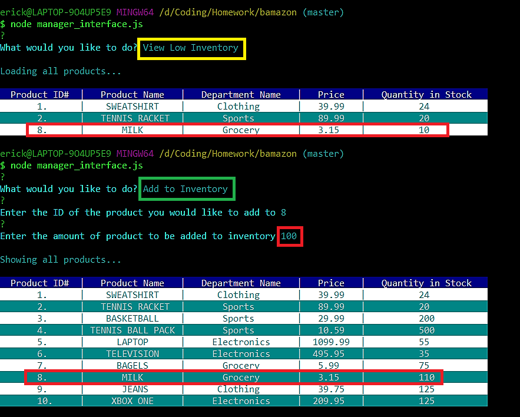

# Inventory Management Simulator

## Description

An application run in the terminal that uses a MySQL database to track the inventory of a store. The application comes with three main parts simulating customer purchases, managing inventory, and viewing sales and departments.

## Examples of how to use each part of the application

1. To simulate a customer purchase
   * Enter "node customer_interface.js" into the terminal as highlighted in yellow below
   * The first query asks the user to select the item they wish to purchase using the name or ID as highlighted in green below
   * The second query asks the user to select how many of that item they wish to purchase
   * After a successful purchase the cost is calculated and displayed and the inventory is adjusted as highlighted in red below
   
   * If the user picks an item that is not in stock it will display an error message and void their order. In the case below the user tries to order a llama and is given the message, "We don't have the item you're looking for in stock! (Or you mistyped!)"
   
   * If the user tries to order more of an item than is currently in inventory it will display an error message and void their order. In the case below the user tries to order 100 sweaters when there are only 44 in inventory and is given the message, "We don't have enough in inventory to fulfill your order!"
   
   
   
2. To simulate managing inventory
   * Enter "node manager_interface.js" and you will be shown the following options
   
   * The first option allows you to see your inventory
   
   * The second option allows you to see your inventory that is running low ( >25 units). While the third option allows you to restock your inventory 
   
   * The fourth option allows you to add new items to your inventory
   

3. To simulate the supervisor role (managing sales and departments)
   * Enter "node supervisor_interface.js" and you will be shown the following options
   
   * The first option allows you to view your sales
   
   * The second option allows you to add a department
   * Once you add a new department you can add items to it using the manager_interface and you can view the department's sales in supervisor interface
   

## Preview
    
A video preview of the application running with voice commentary (audio quality is low)

https://drive.google.com/file/d/1wqLuzk7Zw7XWHVrJYTBccfsi8ruqKJ8c/view

## Notes

This application requires node.js and MySQL to run. Your MySQL password should be included in a .env file as shown below

  * password='mypassword'
  
## Technologies Used
   
   * MySql
   * Node.js
   * Javascript
   
